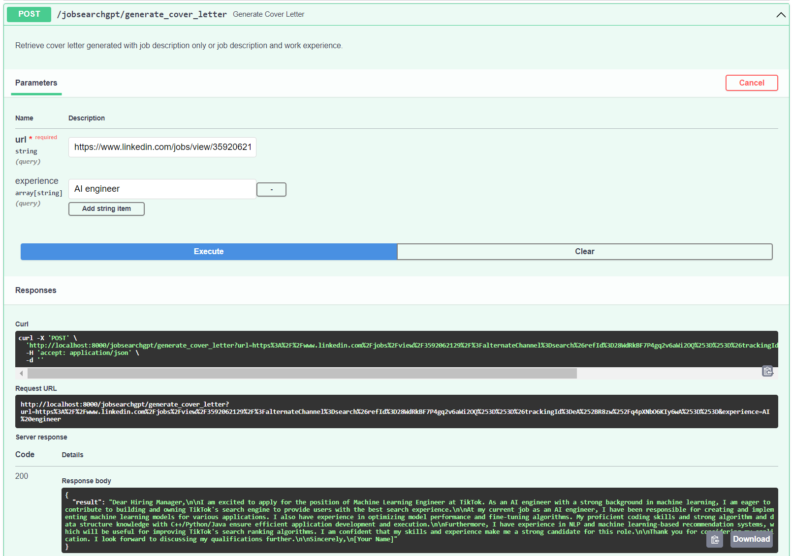

# JobSearchGPT

JobSearchGPT uses the chatGPT API to generate a cover letter for the user, given a link to the job posting on linkedin and a user's work experience.

An example usage is shown in this screenshot of the FastAPI Swagger UI:



To build the docker image, run the command below:

```
docker build `
-t jobsearchgpt-fastapi:0.1.0 `
-f docker/fastapi.Dockerfile `
--platform linux/amd64 .
```

To run the docker container, run the command below:

```
docker run --rm -p 8080:8080 `
--name fastapi-server `
jobsearchgpt-fastapi:0.1.0
```